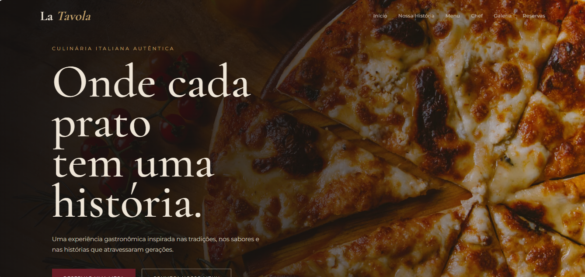

# La Tavola

Projeto de um site para um restaurante, desenvolvido com foco em uma interface moderna, elegante e responsiva.

O site apresenta informações sobre o restaurante, pratos do cardápio e seções pensadas para proporcionar uma boa experiência ao usuário.

## Tecnologias utilizadas

* HTML5
* CSS3
* JavaScript

## Objetivo

O projeto foi desenvolvido para praticar habilidades de desenvolvimento Front-End, criação de layouts responsivos e interações com JavaScript.

## Repositório

[Acesse o projeto no GitHub](https://github.com/RafaelaDesousa33/la_tavola)
